# 基于Vue的社区点餐小程序的设计与实现

> 公开脱敏版：保留论文正文与技术插图；学校模板、页眉页脚、校徽、身份元数据不进入公开文件，含个人资料或凭据的截图已隐藏。

目 录

## 绪论

### 选题背景

随着社会老龄化程度的加剧，养老服务逐渐成为社会关注的焦点之一。而在养老服务中，饮食管理是至关重要的一环。针对养老社区内的居民，特别是那些行动不便或者需要特殊饮食安排的老年人，建立一套高效便捷的点餐系统至关重要。

在传统的养老社区中，餐饮管理往往存在一些问题。首先，手工记录点餐信息耗时费力，容易出错，而且难以及时更新。其次，老年人的饮食需求多种多样，需要个性化的定制方案，但传统的点餐系统往往无法满足这一需求。再者，老年人普遍行动不便，前往餐厅点餐不便，需要一种更为便捷的解决方案。

基于Vue框架的社区养老点餐系统能够有效解决上述问题。Vue作为一种轻量级、高效的前端框架，能够提供流畅的用户体验和响应式的界面设计。通过构建一个基于Vue的Web应用程序，老年人可以通过简单直观的界面进行点餐，提高点餐效率。

建立基于Vue的社区养老点餐系统不仅有利于提升养老服务的质量和效率，还具有重要的社会意义。通过利用现代技术手段，更好地满足老年人的生活需求，促进了老年人的生活质量和幸福感。同时，这种系统也具有较强的推广前景，可以在更多的养老社区或者医养结合型机构中推广应用，为更多的老年人提供便利和关爱。

### 国内外发展现状

目前，国内外对于养老服务的关注度日益提升，餐饮管理作为其中的重要组成部分，也受到了广泛关注。

在国内，随着老龄化进程的加快，养老服务行业蓬勃发展。越来越多的养老机构和社区开始重视餐饮管理，采用各种手段提升服务水平。然而，由于人工成本高、管理复杂等问题，传统的点餐系统在效率和服务质量方面存在一定不足。因此，有必要引入现代化技术来改善点餐系统，提高服务水平。

在国外，一些发达国家对于养老服务已经有了相对成熟的管理经验。一些养老机构和社区已经开始引入智能化点餐系统，通过手机应用或者网页平台，居民可以方便地进行点餐，并且系统会根据个体需求提供个性化菜单和饮食建议。这种系统不仅提高了服务效率，也更好地满足了居民的需求。

总体来说，国内外在养老餐饮管理方面都面临着类似的挑战，即如何提高效率、降低成本、提升服务质量。引入基于Vue的社区养老点餐系统，不仅符合国内外养老服务的发展趋势，也能够有效应对当前存在的问题，提升养老服务的水平和品质。

### 目的与意义

基于Vue的社区养老点餐系统的建立旨在提高养老服务的质量、便利性和个性化水平，具有重要的社会意义和实际应用价值。

1. 提升养老服务质量： 养老服务中的饮食管理是老年人生活质量的重要组成部分。通过引入基于Vue的点餐系统，可以提高餐饮管理的效率和精准度，减少人为错误和延误，从而提升养老服务的整体质量。

2. 促进老年人生活便利性： 老年人常因行动不便或其他原因无法前往餐厅点餐，基于Vue的点餐系统为他们提供了便捷的解决方案。老年人可以通过手机或者平板电脑在家中轻松点餐，不必外出，提高了生活的便利性和舒适度。

3. 实现个性化饮食服务： 每个老年人的饮食需求都可能有所不同，一些人可能有特殊的饮食禁忌或偏好。基于Vue的点餐系统可以根据个体情况提供个性化的菜单和饮食建议，满足不同老年人的特殊需求，实现精准化、个性化的饮食服务。

4. 降低管理成本： 传统的手工记录点餐方式需要耗费大量的人力物力，而且容易出错。引入基于Vue的点餐系统可以大大降低管理成本，提高管理效率，让管理者更专注于提升养老服务的其他方面。

5. 推动养老服务创新发展： 养老服务行业正处于快速发展的阶段，不断引入新技术、新理念是推动行业发展的关键。基于Vue的点餐系统为养老服务的创新发展提供了一个新的方向和示范，有助于推动整个行业的进步和提升。

6. 社会责任与关爱体现： 社区养老点餐系统的建立不仅仅是一项商业行为，更是对社会责任和对老年人的关爱体现。通过提供便捷、高质量的饮食服务，社会为老年人提供了更加舒适、便利的生活环境，体现了对老年人的尊重和关爱。

## 关键技术介绍

### 关键性开发技术介绍

#### Spring Boot

Spring Boot是Spring框架的进化产物，以其约定大于配置的理念，极大地简化了Spring框架的配置繁琐性。通过引入Spring Boot Starter和结合Maven工具，开发人员能够迅速搭建起整合了Spring、Spring MVC、MyBatis等框架的系统，形成一套高效的SSM框架。

它就像一把魔法钥匙，能够以惊人的速度解锁开发过程中的诸多烦扰。Spring Boot通过一系列默认配置，让开发者可以不再为琐碎的配置而烦恼，而是专注于业务逻辑的实现。它的独特之处在于不仅仅提供了快速搭建的能力，还通过内置Tomcat服务器的方式，使得整个开发过程更加轻松，不再需要额外的服务器配置和部署步骤。

#### Vue与Uni-app

在社区养老点餐系统的前端开发中，我们选择采用Vue框架，充分利用其简单、灵活的特点。通过Vue，我们能够构建出响应式、高效的用户界面，实现了系统页面的动态更新和交互。组件化的设计思想让我们可以将页面拆分为独立的组件，提高了代码的可维护性和复用性。Vue框架在系统前端的应用，为用户提供了流畅的操作体验。

UNI-app允许我们使用一套代码，同时在多个平台上运行，如微信小程序、H5、App等。这种跨平台的特性为开发者提供了极大的便利，减少了开发成本和维护工作。通过Uni-app，我们成功地实现了在不同平台上保持一致性的用户体验，为用户提供了更加便捷和统一的使用方式。

#### MySQL数据库

MySQL是一种开源的关系型数据库管理系统（RDBMS），由瑞典MySQL AB公司开发，现为Oracle公司旗下产品。MySQL以其高性能、可靠性和开放源代码的特点而闻名。它支持多种操作系统，包括Windows、Linux和Mac OS，同时提供了丰富的SQL语法和功能，使其成为广泛应用于Web开发、企业级应用等领域的数据库选择。

在Vue社区养老点餐系统中，MySQL是我们选择的主要数据库。它被用于存储用户信息、订单数据、餐品数据等关键信息。通过使用MySQL，能够建立起高效、可扩展的数据库结构，确保系统能够存储和检索大量数据。MySQL的事务管理和数据完整性保障了系统在并发操作和数据操作方面的稳定性，为系统提供了可靠的数据支持。

#### MyBatis-Plus

MyBatis-Plus（简称MP）是MyBatis框架的增强工具包，为MyBatis提供了更多实用的功能和便捷的操作。它简化了MyBatis的使用流程，提供了更多方便的注解和API，支持代码生成、分页查询、性能分析等功能。MyBatis-Plus旨在提高开发效率，减少重复代码，使得MyBatis的使用更加简单和便捷。

在社区养老点餐系统中，采用了MyBatis-Plus作为持久层框架。它大大简化了数据库操作的代码，通过代码生成工具，能够自动生成实体类、Mapper接口和XML映射文件，减轻了开发者的重复工作。同时，MyBatis-Plus提供了强大的查询构建器，支持链式调用，使得复杂的查询变得更加简单和直观。

MyBatis-Plus还提供了基于注解的CRUD操作，极大地减少了SQL语句的编写，提高了开发效率。其内置的分页插件支持灵活的分页查询，为系统中的数据分页展示提供了良好的支持。

### 其它相关技术

#### HTTP请求

HTTP（Hypertext Transfer Protocol）是一种用于传输超文本的协议，是Web上数据通信的基础。它基于请求-响应模型，客户端通过发送HTTP请求向服务器请求资源，服务器通过HTTP响应返回请求的资源。HTTP通常运行在TCP协议之上，使用URL作为统一资源定位符来标识资源。HTTP请求方法包括GET、POST、PUT、DELETE等，而请求头和请求体则包含了传输的详细信息。

#### Redis

Redis（Remote Dictionary Server）是一个开源的内存中数据结构存储系统，它可以用作数据库、缓存和消息中间件。Redis支持多种数据结构，如字符串、哈希、列表、集合、有序集合等，提供了丰富的命令集合，可用于对这些数据结构进行操作。

Redis的主要特点包括：

高性能： Redis是基于内存的存储系统，所有的数据都存储在内存中，因此读写速度非常快，适用于对速度有较高要求的场景。

丰富的数据结构： Redis支持多种数据结构，如字符串、哈希、列表、集合、有序集合等，每种数据结构都有丰富的操作命令，可以满足不同场景的需求。

持久化支持： Redis支持将内存中的数据持久化到磁盘上，以保证数据的安全性和持久性。支持的持久化方式包括快照（snapshot）和日志（append-only file）两种。

分布式支持： Redis提供了一些分布式特性，如主从复制（replication）和分区（partitioning），能够帮助构建高可用性和高扩展性的系统。

原子性操作： Redis提供了一些原子性操作命令，如INCR、DECR、SETNX等，能够保证操作的原子性，避免了并发访问时的竞态条件。

发布/订阅模式： Redis支持发布/订阅模式，可以实现消息的广播和订阅，用于构建消息中间件和实时通信系统。

多语言支持： Redis提供了多种语言的客户端库，如Python、Java、Node.js等，可以方便地与各种编程语言进行集成和交互。

总的来说，Redis是一个功能强大、性能优越、灵活多样的内存中数据存储系统，适用于各种场景下的数据存储、缓存和消息传递需求。

## 系统分析

### 功能性需求分析

针对社区养老点餐系统的设计，系统分为前台和后台两部分，以满足不同用户群体的需求。前台用户主要包括老年居民，他们可以通过前台界面进行餐品搜索、餐品分类查询、点餐、订单收货以及订单评价等操作，以方便地进行饮食管理。这些功能旨在提供便捷的点餐体验，满足老年人的个性化饮食需求，同时也方便他们管理自己的订单。

后台用户主要包括社区工作人员和餐饮服务管理者，他们拥有订单管理和餐品管理等功能。订单管理功能包括订单查看、处理和跟踪等，以确保订单能够及时处理并保证餐食的送达。餐品管理功能则涵盖了菜单更新、价格调整和库存管理等，以保证餐品信息的准确性和及时性，满足老年居民的饮食偏好和需求。同时，后台用户还能通过系统的数据分析功能，了解老年居民的点餐偏好和消费习惯，为餐品的调整和优化提供数据支持。

通过这样的前后台设计，社区养老点餐系统能够全面满足老年居民和管理者的需求，提升养老服务的质量和效率。前台用户可以便捷地进行点餐操作，享受个性化的餐饮服务；后台用户则能够有效管理订单和餐品信息，保障餐食供应的及时性和品质，从而共同促进社区养老服务的进步与发展。

#### 前台用户用例描述

前台用户用例图如图3.1所示，主要包括以下几个用例：

1. 餐品浏览用例：

餐品详情查看： 用户可以查看具体餐品的详细信息，包括餐品名称、价格、图片以及描述等。

分类查看： 用户可以按照不同的分类（如菜系、食材、热门推荐等）来浏览系统中的餐品列表。

餐品查询： 用户可以通过关键词搜索系统中的餐品信息，以便快速找到所需的餐品。

评价查询： 用户可以查看其他用户对餐品的评价和评分，以帮助做出点餐决策。

点餐：用户可以对心仪的餐品进行点餐购买操作。

2. 个人中心用例：

信息修改： 用户可以修改个人信息，如昵称、头像、联系方式等。

订单管理： 用户可以查看历史订单、订单详情以及订单状态，并进行订单的取消或修改。

评价查看： 用户可以查看自己对订单的评价以及其他用户对自己的评价。

收货地址管理： 用户可以管理收货地址，包括新增、修改和删除地址等操作。

登录： 用户可以进行账号登录，以便享受个性化的服务和管理自己的订单信息。

注册： 用户可以进行账号注册，成为系统的注册用户，以便使用系统的全部功能和服务。

这些用例涵盖了用户在前台系统中的主要操作，旨在提供用户友好的界面和流程，使用户能够方便快捷地进行点餐和管理个人信息

图3.1 前台用户用例图

个人中心用例中的注册登录用例描述如表3.1所示，前台用户输入姓名，手机号码，登录账号与密码，头像进行系统注册，注册成功后，输入账号与密码进行登录，系统将生成JWT，用户凭借该JWT可以访问需要登录才可以访问的功能：点餐，订单评价，个人中心等。

表3.1 注册登录

<table>
<tr><td>用例名称</td><td>注册与登录</td></tr>
<tr><td>参与者</td><td>前台用户</td></tr>
<tr><td>描述</td><td>输入基本信息进行账号注册（姓名，账号，密码，头像（可选））注册成功后，输入账号密码进行登录</td></tr>
<tr><td>前置条件</td><td>无</td></tr>
<tr><td>后置条件</td><td>无</td></tr>
<tr><td>事件流</td><td>1.用户进入App，点击个人中心 2.系统判断当前用户是否登录，如果没有登录，跳转登录界面 3.用户点击注册按钮，跳转注册界面 4.用户输入个人基本信息，完成账号注册 5.用户输入注册步骤的账号与密码，进行系统登录，如果登录成功，系统跳转首页，并且在本地缓存服务端传回的JWT 6.如果登录失败，系统提示用户失败原因</td></tr>
</table>

餐品浏览用例中的查询，用户可以进行餐品姓名的模糊查询，分类查询，并且系统会缓存用户查询记录，以此来实现快速点餐功能，用例描述如表3.2所示。

表3.2 餐品浏览查询

<table>
<tr><td>用例名称</td><td>餐品浏览</td></tr>
<tr><td>参与者</td><td>前台用户</td></tr>
<tr><td>描述</td><td>对餐品进行名字模糊查询，分类查询，评价信息查询</td></tr>
<tr><td>前置条件</td><td>无</td></tr>
<tr><td>后置条件</td><td>无</td></tr>
<tr><td>事件流</td><td>1.用户进入App，进入App首页 2.首页展示所有餐品数据，用户可以上拉加载与下拉刷新进行分页查询 3.用户点击分类按钮，进入餐品分类界面。分类采用树形结构展示，用户可以进行分类查询 4.用户可以点击搜索框，系统跳转搜索界面，用户输入餐品名称，系统展示有关该餐品的所有数据，并记录用户的搜索，存储在App内存中 5.用户点击餐品列表中的一列，系统跳转餐品详细页面 6.用户点击评价查看，可以查看该餐品的所有评价信息</td></tr>
</table>

餐品用例中的点餐用例描述如表3.3所示，用户进行点餐，用户可以选择送货方式（到店与配送），当用户选择配送时候，用户需要选择收货地址，选择后，系统后台接受到订单，等待配送即可；如果用户选择的是到店，需要用户到店消费。

表3.3 用户点餐

<table>
<tr><td>用例名称</td><td>用户点餐</td></tr>
<tr><td>参与者</td><td>前台用户</td></tr>
<tr><td>描述</td><td>进行点餐，点餐时可以选择到店消费或者配送</td></tr>
<tr><td>前置条件</td><td>用户需要登录</td></tr>
<tr><td>后置条件</td><td>无</td></tr>
<tr><td>事件流</td><td>1.用户进入App，进入餐品详情界面 2.用户点击点餐按钮，系统跳转订单确认界面 3.用户选择消费方式；如果是到店消费模式界面无任何变化，如果是配送方式，界面展示收货地址，并展示该用户设置的默认收货地址，如果没有需要用户进行收货地址添加 4.用户点击提交订单，系统跳转个人中心界面，用户等待后台处理即可</td></tr>
</table>

个人中心用例中的订单管理用例描述如表3.4所示，用户可以查看本人在系统中的所有订单数据，并可以进行分类查询，当订单状态为待配送，用户可以进行订单的取消；订单状态为已配送，可以进行订单完成；订单状态为待评价，用户可以进行评价操作。

表3.4 订单管理

<table>
<tr><td>用例名称</td><td>订单管理</td></tr>
<tr><td>参与者</td><td>前台用户</td></tr>
<tr><td>描述</td><td>查看本人所有订单，并可以按照订单类型的不同对订单进行不同的操作</td></tr>
<tr><td>前置条件</td><td>登录进入系统</td></tr>
<tr><td>后置条件</td><td>无</td></tr>
<tr><td>事件流</td><td>1.用户进入App，点击个人中心 2.可以在个人中心首页，查看本人所有订单数据 3.点击待配送按钮，系统跳转到订单列表界面，并显示待配送的订单 4.用户点击取消按钮，即可对订单进行取消操作 5.用户点击已配送，App展示已配送的订单，用户点击完成按钮，订单完成，订单状态为待评价 6.用户点击待消费按钮，显示待到店消费的订单 7.用户点击待评价按钮，即可查看所有待评价的订单，用户点击评价按钮，输入评价内容，完成评价后，订单状态为已完成</td></tr>
</table>

收货地址管理用例如表3.5所示，用户可以进行收货地址的增加，修改，删除操作。

表3.5 收货地址管理

<table>
<tr><td>用例名称</td><td>收货地址管理</td></tr>
<tr><td>参与者</td><td>前台用户</td></tr>
<tr><td>描述</td><td>查看本人所有收货地址，并对其进行增加，修改，删除操作</td></tr>
<tr><td>前置条件</td><td>登录进入系统</td></tr>
<tr><td>后置条件</td><td>无</td></tr>
<tr><td>事件流</td><td>1.用户进入App，点击个人中心 2.点击收货地址按钮，系统跳转收货地址列表界面，界面展示该用户的所有收货地址 3.用户点击添加按钮，系统跳转地址添加界面，用户输入完所有信息后，点击完成添加成功 4.用户点击编辑按钮，系统跳转订单编辑界面，用户点击删除按钮，即该收货地址将被删除 5.用户点击立即保存按钮收货地址将被更新</td></tr>
</table>

#### 后台用户用例描述

后台用户用例图如图3.2所示，后台用户主要有登录，用户管理，点餐用户管理，订单管理，餐品管理，餐品分类管理，销售统计分析，这些用例涵盖了后台用户在管理系统中的主要操作，帮助后台用户更好的管理数据。

图3.2 后台用户用例图

用户管理用例描述如表3.6所示，后台用户可以进行后台用户的增加，删除，修改操作，进行点餐用户的查询，禁止登录操作。

表3.6 用户管理

<table>
<tr><td>用例名称</td><td>用户管理</td></tr>
<tr><td>参与者</td><td>后台用户</td></tr>
<tr><td>描述</td><td>后台用户的增加，删除，修改，查询；点餐用户的查询，禁止登录</td></tr>
<tr><td>前置条件</td><td>登录进入系统</td></tr>
<tr><td>后置条件</td><td>无</td></tr>
<tr><td>事件流</td><td>1.后台用户登入系统，进入用户管理界面，界面展示点餐用户列表信息 2.后台用户可以进行手机号，用户名查询，可以进行分页查询 3.后台用户点击禁止登录，该点餐用户将无法进行登录与点餐 4.后台用户点击管理员按钮，界面将展示后台用户列表，可以对其手机号，用户名查询与分页查询 5.用户点击删除按钮，被选中的数据将被删除 6.用户点击密码重置按钮，被选中的用户密码将被重置为123456 7.后台用户点击增加按钮，系统弹出弹窗，输入基本信息后，点击保存，列表将自动更新，弹窗将自动隐藏。</td></tr>
</table>

餐品与餐品分类管理用例描述如表3.7所示，用户可以进行餐品分类的添加，修改，删除，查询，餐品的编辑，评价查看，删除，下架。

表3.6 餐品与餐品分类管理

<table>
<tr><td>用例名称</td><td>餐品与餐品分类管理</td></tr>
<tr><td>参与者</td><td>后台用户</td></tr>
<tr><td>描述</td><td>可以对餐品与餐品分类数据进行管理</td></tr>
<tr><td>前置条件</td><td>登录进入系统</td></tr>
<tr><td>后置条件</td><td>无</td></tr>
<tr><td>事件流</td><td>1.后台用户登入系统，点击餐品分类管理，进入餐品分类界面，界面将树形展示 2.点击删除按钮，如果删除是的顶级分类，则顶级分类下的子级分类将被删除，如果删除的是子级分类，则该子级分类将被删除 3.点击编辑可以修改分类名称，如果是子级分类的编辑，还可以修改分类图片 4.点击增加，系统弹出弹窗，如果上级名称为请选择，增加的为顶级分类，如果上级名称为其他值，则增加的子级分类，将显示图片上传按钮，增加成功后弹窗隐藏，列表刷新 5.用户点击餐品列表，进入餐品列表界面，用户可以进行名称模糊查询 6.用户点击编辑，系统跳转餐品编辑界面，用户编辑成功后，系统跳转餐品列表界面，自动更新数据 7.用户点击查看评价按钮，系统弹出弹窗，展示该餐品服务的所有评价信息，如果评价未被回复，用户可以进行评价回复 7.用户点击下架按钮，餐品将被无法显示在前台</td></tr>
</table>

订单管理用例描述如表3.7所示，用户可以进行，订单分类查询，订单配送，删除，评价查看与回复操作。

表3.7 订单管理

<table>
<tr><td>用例名称</td><td>订单管理</td></tr>
<tr><td>参与者</td><td>后台用户</td></tr>
<tr><td>描述</td><td>订单查询，订单评价查看回复，订单配送，订单消费，订单完成</td></tr>
<tr><td>前置条件</td><td>登录进入系统</td></tr>
<tr><td>后置条件</td><td>无</td></tr>
<tr><td>事件流</td><td>1.后台用户进入订单管理界面 2.用户可以进行餐品名称，点餐用户手机号，订单编号，点餐用户名称查询 3.对于待配送的订单，系统弹出界面，用户输入配送员信息，点击保存按钮，订单状态修改为已配送 4.对于待消费的订单，用户点击消费按钮，订单状态为待评价 5.对于已完成的订单，用户可以查看评价信息（与餐品管理用例中的评价信息逻辑一致） 6.用户点击编辑，系统跳转餐品编辑界面，用户编辑成功后，系统跳转餐品列表界面，自动更新数据 7.点击删除按钮，该订单将被删除</td></tr>
</table>

### 非功能性需求分析

性能需求：

响应时间： 系统应保证在用户进行点餐、查询等操作时，响应时间不超过2秒，确保用户体验流畅。

并发性能： 系统应能够支持多用户同时进行点餐和查询操作，具有良好的并发处理能力，保证系统的稳定性和性能表现。

吞吐量： 系统应能够处理大量的点餐请求，保证高并发情况下的吞吐量，以应对突发访问量的情况。

安全性需求：

数据安全： 系统应具有严格的数据安全机制，包括用户信息、订单信息等数据的加密存储和传输，防止数据泄露和篡改。

权限控制： 系统应实现严格的权限控制机制，确保不同用户只能访问其具有权限的功能和数据，防止未授权操作。

防止攻击： 系统应具备防御常见攻击（如SQL注入、跨站脚本攻击等）的能力，保障系统的安全性和稳定性。

可靠性需求：

系统稳定性： 系统应具备高可靠性，保证在24小时内运行稳定，不出现严重故障和崩溃。

故障恢复： 系统应具备快速的故障恢复能力，当系统出现故障时能够迅速恢复并保证数据不丢失。

可用性需求：

系统可用性： 系统应保证每周7天、每天24小时的稳定运行，用户可以随时随地访问和使用系统。

故障提示： 系统应具备故障提示功能，及时向用户反馈系统维护或故障信息，以便用户及时调整操作。

可维护性需求：

易于扩展： 系统应具备良好的可扩展性，方便后续对系统进行功能扩展和升级。

代码规范： 系统代码应符合规范，易于维护和管理，包括清晰的注释、模块化设计等。

### 可行性分析

技术可行性：目前，各种技术和工具已经广泛应用于餐饮行业，如前端开发框架（Vue.js）、后端开发框架（Node.js）、数据库管理系统（MySQL）、云计算平台等。这些现有技术可以支持社区养老点餐系统的开发和实现。鉴于系统涉及用户的个人信息和支付信息，必须确保数据的安全性。通过加密技术、权限控制、数据备份等手段，可以有效保护用户数据的安全。社区养老点餐系统需要保证24/7稳定运行，应采用高可用性架构，如负载均衡、故障转移等，以确保系统的稳定性和可靠性。

经济可行性：项目开发和运营涉及到硬件设备、软件开发、人力成本、运营维护等方面的费用。需要进行详细的成本估算，确保项目的投入能够获得合理的回报。餐饮服务市场庞大，特别是针对老年人的养老服务市场潜力巨大。通过提供便捷的点餐服务，可以吸引更多的老年用户，增加系统的用户量和订单量，从而带来可观的收益。需要对项目的风险进行评估，包括市场竞争、技术变革、法律法规变化等方面的风险，并制定相应的风险应对策略，降低项目的经济风险。

市场可行性：随着老龄化程度的不断加深，社区养老服务市场需求日益增长。社区养老点餐系统可以满足老年用户对便捷、个性化餐饮服务的需求，具有良好的市场前景。虽然社区养老点餐系统市场潜力大，但竞争也较为激烈。需要进行市场竞争分析，了解竞争对手的优势和劣势，制定相应的竞争策略。需要制定有效的市场推广策略，包括线上线下渠道的推广、与养老机构的合作等，以吸引更多用户和扩大市场份额。

从技术、经济和市场三个方面进行可行性分析，社区养老点餐系统在技术上有成熟的支持和可行的实现方案，在经济上有可观的收益预期，在市场上有广阔的发展前景，因此具备较高的可行性。

## 系统设计

### 架构设计

图4.1 系统架构图

1. 前端架构：Vue与Uni-app：使用Vue与Uni-app构架前端响应式界面。数据交互：通过Ajax进行前后端的数据交互，支持主要的HTTP请求类型，包括POST与GET。

2. 后端架构：Spring Boot框架：作为服务端的主要开发框架，提供快速搭建与开发的优势，支持RESTful API的开发。SSM架构：使用Spring、Spring MVC和MyBatis-plus的组合，实现了系统的业务逻辑、控制层和持久层的分离。全局异常与返回处理：实现全局异常处理机制，确保系统在面对异常情况时能够友好地向前端返回响应。数据交互与事务处理：利用ORM框架进行数据库操作，确保数据的一致性。采用声明式事务机制，保证用户操作的原子性。

3. 数据库：MySQL数据库：主要存储用户数据，餐品数据等信息，Redis主要存储当前登录用户信息，系统软件架构图如图4.1所示。

### 功能设计

#### App用户登录注册

用户向Controller发送注册请求，register方法：用于处理用户注册请求的接口方法。当用户发送注册请求时，该方法接收到用户提交的注册信息，其中包括用户的姓名、手机号码等信息。该方法将接收到的用户信息传递给userService的registerAppUser方法进行处理。registerAppUser方法：会检查用户是否已经存在于数据库中。通过查询用户的手机号码是否已经存在来判断用户是否已注册。如果用户已经存在，则抛出自定义的ResultException异常，告知注册失败，用户已存在。如果用户不存在，则会将用户的注册时间设置为当前时间，并对用户的密码进行加密处理。最后，将加密后的用户信息插入到数据库中，时序图如图4.2所示。

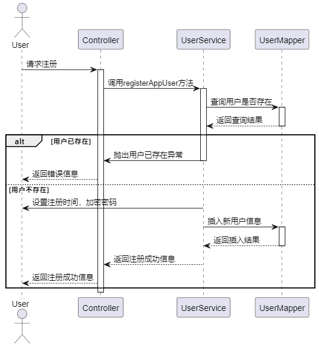

图4.2 注册时序图

当用户发送登录请求时，该方法接收到用户提交的登录信息，包括用户账号和密码。然后调用userService的login方法进行用户登录认证，并将认证结果以Result对象的形式返回给前端。authLogin方法：userService中的私有方法，用于实现用户登录认证的具体逻辑。首先，根据用户输入的账号查询数据库中是否存在对应的用户信息。如果不存在，则抛出自定义的ResultException异常，表示用户名或密码错误。如果存在对应的用户信息，则对用户输入的密码进行加密后与数据库中的密码进行比对。如果密码正确，则生成JWT token，并将用户认证信息设置到Spring Security的上下文中，以实现用户认证。同时，将用户的基本信息注入到UserLocal中，时序图如图4.3所示。

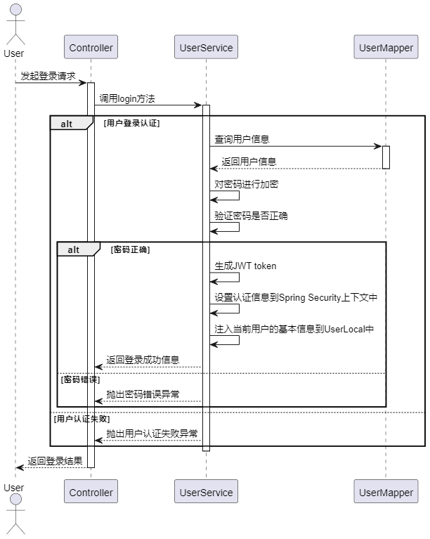

图4.3 用户登录时序图

#### 餐品浏览查询

goodsPage方法：当用户发送获取餐品列表的请求时，Controller接收到请求，并调用goodsService的goodsPageByApp方法进行处理。该方法将获取到的餐品列表数据封装成Result对象返回给前端。goodsPageByApp方法：用于实现获取餐品列表的逻辑。首先，根据前端传递的分页参数，构建分页查询条件。然后调用goodsMapper中的selectGoodsByPageApp方法进行餐品列表查询，返回分页查询结果。对查询结果中的餐品图片字段进行处理，将图片字符串转换为图片列表。最终返回处理后的分页查询结果。SQL查询语句： selectGoodsByPageApp是对餐品列表的查询SQL语句。根据前端传递的参数进行动态条件查询，包括餐品名称、餐品分类等条件。同时，进行了分页查询和聚合查询，以便获取餐品列表的详细信息和统计信息，时序图如图4.4所示。

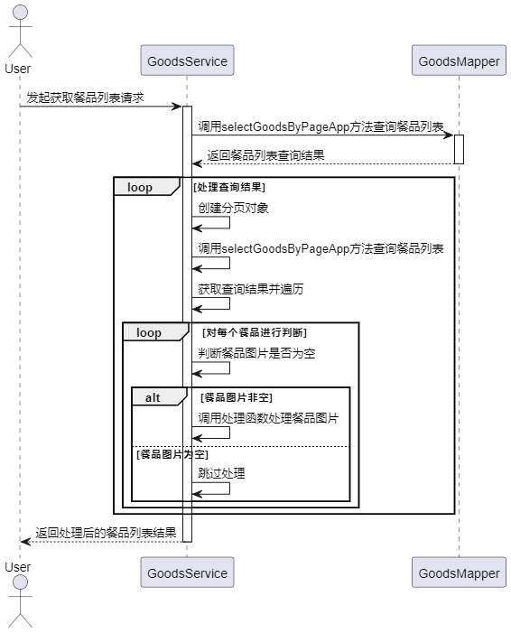

图4.4 餐品查询

当用户发送获取餐品详情的请求时，Controller接收到请求，并从路径参数中获取餐品ID。然后调用goodsService的goodsDetail方法进行处理，并将处理结果返回给前端。goodsDetail方法用于实现获取餐品详情的逻辑。首先，根据餐品ID查询数据库中对应的餐品详情信息。然后，判断餐品图片字段是否为空，如果不为空，则调用BaseFunction类中的方法将图片字符串转换为图片列表，并设置到餐品详情对象中。接着，查询该餐品的评价总数，并将结果设置到餐品详情对象中。最后，返回处理后的餐品详情对象，时序图如图4.5所示。

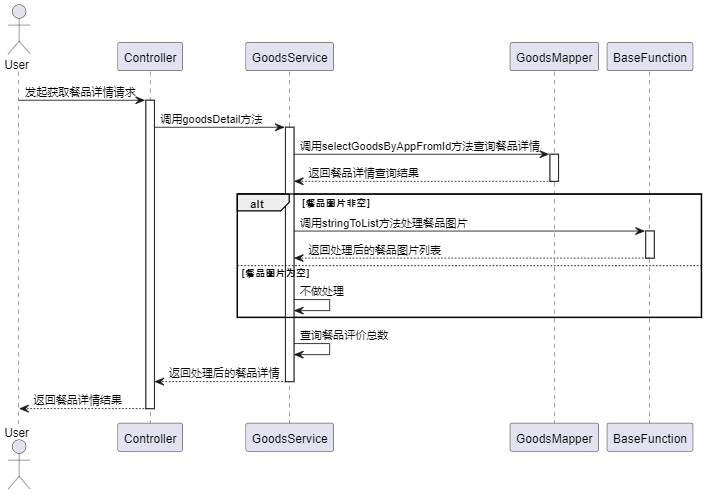

图4.5 餐品详情

当用户提交订单时，Controller接收到订单信息，并调用orderService的saveBatch方法保存订单数据。首先对订单列表进行遍历，对每个订单进行处理。针对每个订单，设置订单编号、下单时间、用户ID等基本信息。根据订单的消费方式（配送或到店消费），设置订单状态为待收货或待消费。然后根据订单中餐品的单价计算购买数量，并更新对应餐品的库存。最后，将处理后的订单列表批量保存到数据库中，时序图如图4.6所示。

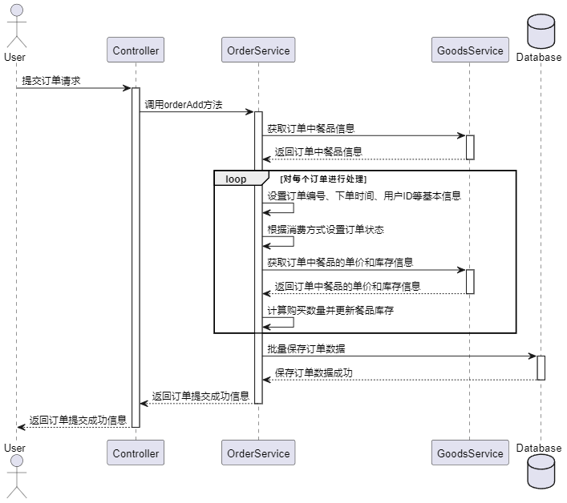

图4.6 点餐

#### 订单管理

用户可以通过传递status（订单状态）、current（当前页码）和size（每页显示数量）等参数来获取相应的订单列表信息。首先根据当前用户的ID设置查询条件，然后调用orderMapper的orderPage方法进行订单列表查询。查询结果是一个IPage对象，其中包含了订单列表的分页信息和具体订单数据。对查询结果中的每个订单数据进行遍历，将订单中的餐品图片字符串转换为图片列表，并设置到订单详情对象中。最后，将处理后的订单列表返回给前端，时序图如图4.7所示。

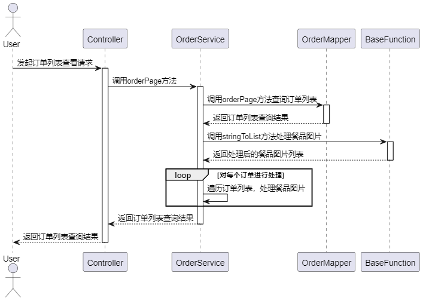

图4.7 订单获取时序图

用户可以通过该接口提交对订单的评价信息。评价信息包括评价内容、评分等。首先设置评价信息的时间和用户ID，然后调用evaluationService的save方法将评价信息保存到数据库中。接着，根据评价信息中的订单ID，调用orderService的updateStatus方法修改订单状态。评价完成后，订单状态更新为已评价状态，时序图如图4.8所示。

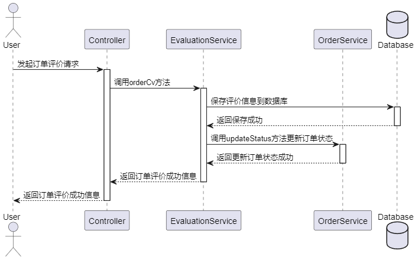

图4.8 订单评价时序图

#### 收货地址管理

用户可以通过该接口获取自己的收货地址信息，首先从请求中获取当前页码和每页显示数量，然后根据当前用户的ID构建查询条件，使用QueryWrapper查询用户对应的收货地址信息。接着，调用addressService的page方法进行分页查询，并将查询结果封装成Result对象返回给前端，时序图如图4.9所示。

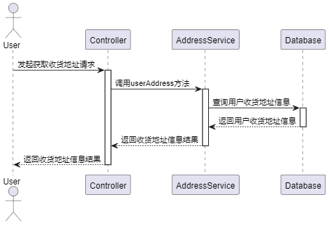

图4.9 收货地址获取

用户可以通过该接口添加新的收货地址信息。首先判断收货地址对象中的ID属性是否为空。如果ID不为空，则表示用户要更新现有的收货地址信息，调用addressService的updateById方法进行更新操作。如果ID为空，则表示用户要添加新的收货地址信息，首先设置收货地址对象的用户ID为当前用户的ID，然后调用addressService的save方法将收货地址信息保存到数据库中，时序图如图4.10所示。

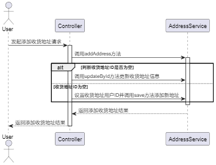

图4.10 收货地址添加与修改

#### 用户管理

用户向Controller发送列表查询请求，Controller调用UserService的list方法进行处理。UserService内部调用UserMapper的selectUserByPage方法查询用户列表。查询结果返回后，UserService将用户列表查询结果返回给Controller，Controller再将查询结果返回给用户，查询时序图如图4.11所示。

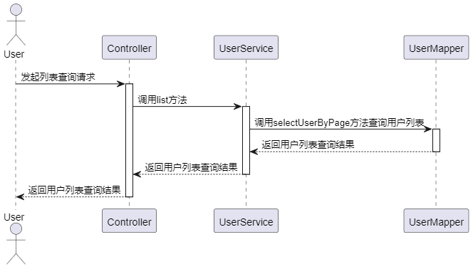

图4.11 用户管理时序图

用户向Controller发送用户操作请求，Controller调用UserService的operationUser方法进行处理，方法接收一个用户对象和一个操作类型参数operationType，根据不同的操作类型对用户进行相应的操作。首先根据用户ID从数据库中查询出对应的用户信息。

根据操作类型进行相应的操作：如果是禁止登录操作（operationType为0），则将用户类型设为NOLOGIN并更新用户信息。如果是允许登录操作（operationType为1），则将用户类型设为CUSTOMER并更新用户信息。如果是重置密码操作（operationType为2），则将用户密码重置为默认密码，并更新用户信息。如果是修改信息操作（operationType为3），则进行密码和用户名的校验，根据校验结果更新用户信息。如果修改了密码，则强制用户退出登录。如果是添加用户操作（operationType为4），则调用register方法进行用户注册。。最终，UserService将操作结果返回给Controller，Controller再将操作结果返回给用户，时序图如图4.12所示。

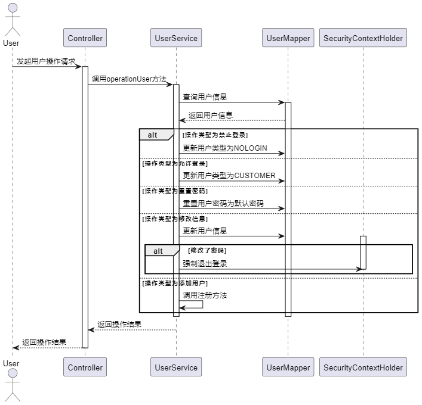

图4.12 用户操作时序图

#### 餐品管理

餐品分类时序图如图4.13所示，系统首先查询数据库获取分类列表数据，然后根据数据的结构特点，进行循环遍历处理。在循环中，系统检查每个分类节点是否有子节点，若有，则递归查找并将其添加到父节点的子节点列表中。这个过程重复进行，直到所有节点都被处理完毕，最终返回构建好的树形结构给用户。

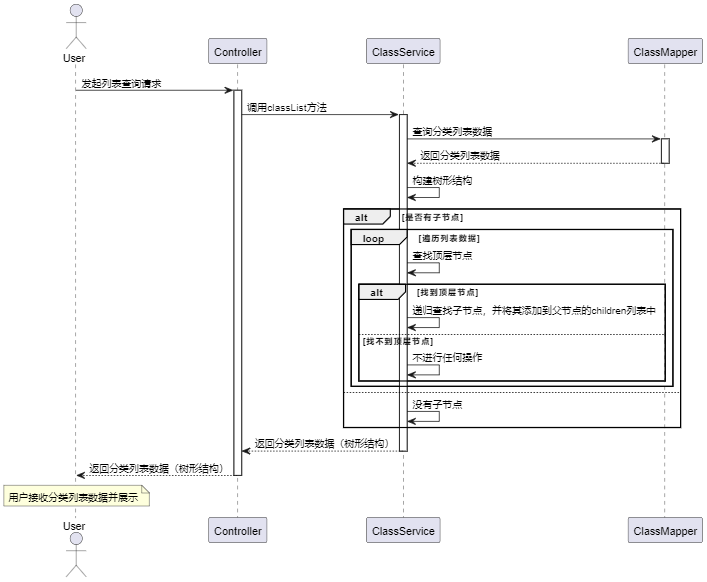

图4.13 餐品分类获取时序图

用户发起数据库操作请求后，控制器Controller调用了operationClass方法进行处理。ClassService内部根据操作类型调用ClassMapper执行数据库操作，然后将操作结果返回给Controller。最终，Controller将操作结果返回给用户根据传入的操作类型和数据类型调用相应的服务方法进行数据库操作，调用classService的operationClass方法，根据操作类型（ADD、UPDATE、DELETE）执行相应的数据库操作。时序图如图4.14所示。

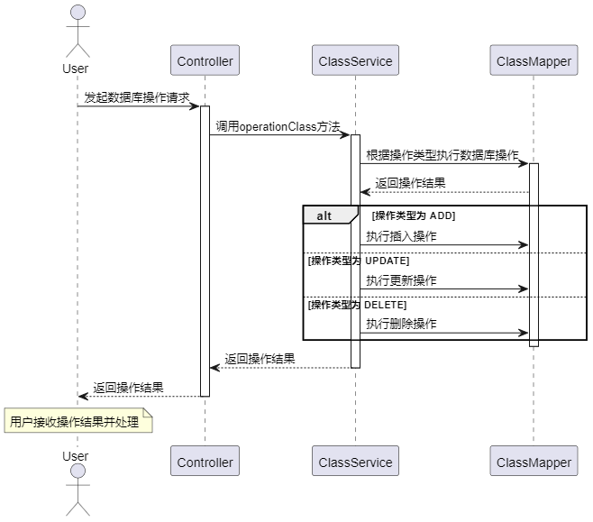

图4.14 餐品分类操作时序图

用户操作请求经过控制器传递给餐品服务服务，然后根据不同的操作类型（更新、删除、添加），餐品服务服务调用餐品服务数据访问层进行相应的数据库操作。如果操作类型是更新，则执行更新操作；如果是删除，则执行删除操作；如果是添加，则执行插入操作。每种操作完成后，结果被返回给餐品服务服务，然后传递回控制器，最终返回给用户。这个流程中，控制器负责接收用户请求和返回结果，餐品服务服务负责根据请求类型调用相应的数据库操作，而餐品服务数据访问层则负责实际执行数据库操作，时序图如图4.15所示。

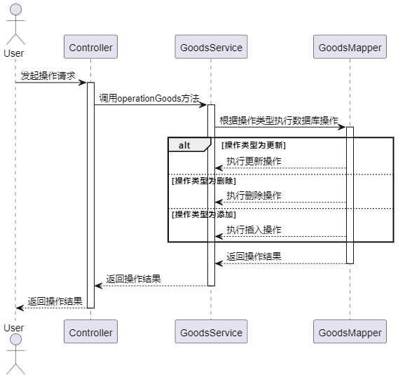

图4.15 餐品操作时序图

#### 订单管理

用户发起操作请求后，控制器调用订单服务的操作方法。根据不同的操作类型，订单服务调用相应的数据访问层方法进行订单的更新或删除操作。如果是更新操作，则根据订单状态的不同，可能需要插入取货人信息，并更新订单状态。如果是删除操作，则直接删除订单。最后，操作结果被返回给控制器，然后返回给用户时序图如图4.16所示。

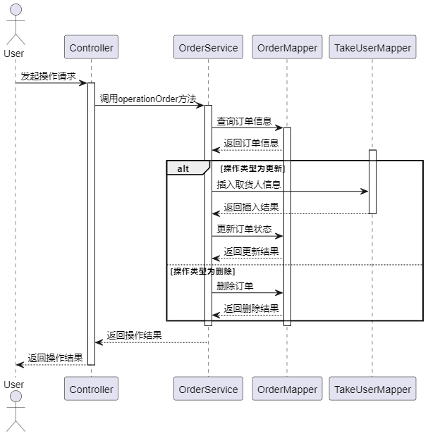

图4.16 订单管理时序图

### 数据库设计

#### E-R图设计

本系统应该具有7张表：用户表，用户收货地址表，餐品表，餐品分类表，订单表，骑手表，评价表，并且用户表与订单表，评价表为一对多关系，餐品表与餐品分类表为一对多关系，与订单表为一对多关系，与评价表为一对多关系，用户收货地址表与用户表为多对一关系，与订单表为一对多关系，因此本系统的E-R关系图如图4.17所示。

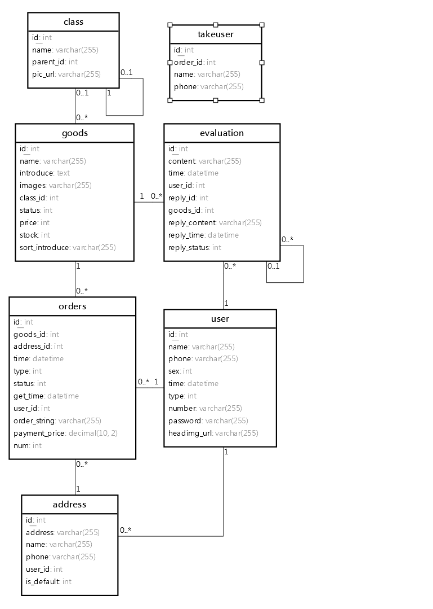

图4.17 E-R图

#### 数据库表设计

用户表中内容如表4.1user表所示，用来存储用户有关的数据，关键字段为type来区分App用户与后台用户。

表4.1 user

<table>
<tr><td>字段名</td><td>数据类型</td><td>主键/允许空</td><td>字段含义</td></tr>
<tr><td>headimg_url</td><td>varchar(255)</td><td>NOT NULL</td><td>头像</td></tr>
<tr><td>id</td><td>int</td><td>PRIMARY KEY</td><td>用户表主键</td></tr>
<tr><td>name</td><td>varchar(255)</td><td>NOT NULL</td><td>用户表姓名</td></tr>
<tr><td>number</td><td>varchar(255)</td><td>NOT NULL</td><td>登录账号</td></tr>
<tr><td>password</td><td>varchar(255)</td><td>NOT NULL</td><td>登录密码</td></tr>
<tr><td>phone</td><td>varchar(255)</td><td>NOT NULL</td><td>电话号码</td></tr>
<tr><td>sex</td><td>int</td><td>NOT NULL</td><td>性别</td></tr>
<tr><td>time</td><td>datetime</td><td>NOT NULL</td><td>注册时间</td></tr>
<tr><td>type</td><td>int</td><td>NOT NULL</td><td>0顾客2管理员，3禁止登录</td></tr>
</table>

地址表如表4.2address表所示，地址表与用户表关联，关联的字段为address_user_id，帮助系统通过用户主键查询属于该用户的地址信息。

表4.2 address表

<table>
<tr><td>字段名</td><td>数据类型</td><td>主键/允许空</td><td>字段含义</td></tr>
<tr><td>address</td><td>varchar(255)</td><td>NOT NULL</td><td>地址</td></tr>
<tr><td>id</td><td>int</td><td>PRIMARY KEY</td><td>主键</td></tr>
<tr><td>is_default</td><td>int</td><td>NULL</td><td>0不是1是</td></tr>
<tr><td>name</td><td>varchar(255)</td><td>NOT NULL</td><td>姓名</td></tr>
<tr><td>phone</td><td>varchar(255)</td><td>NOT NULL</td><td>电话号码</td></tr>
<tr><td>user_id</td><td>int</td><td>NOT NULL</td><td>用户表关联</td></tr>
</table>

分类表如表4.3class表所示，关键字段为id与parent_id来进行树的构造。

表4.3 class表

<table>
<tr><td>字段名</td><td>数据类型</td><td>主键/允许空</td><td>字段含义</td></tr>
<tr><td>id</td><td>int</td><td>PRIMARY KEY</td><td>分类表</td></tr>
<tr><td>name</td><td>varchar(255)</td><td>NOT NULL</td><td>名称</td></tr>
<tr><td>parent_id</td><td>int</td><td>NULL</td><td>父级</td></tr>
<tr><td>pic_url</td><td>varchar(255)</td><td>NULL</td><td>图片</td></tr>
</table>

餐品表如表4.4foods表所示，主要字段为class_id用以分类查询，images用以存储餐品图片。

表4.4 foods表

<table>
<tr><td>字段名</td><td>数据类型</td><td>主键/允许空</td><td>字段含义</td></tr>
<tr><td>class_id</td><td>int</td><td>NULL</td><td>所属分类</td></tr>
<tr><td>id</td><td>int</td><td>PRIMARY KEY</td><td>主键</td></tr>
<tr><td>images</td><td>varchar(255)</td><td>NOT NULL</td><td>4张图片</td></tr>
<tr><td>introduce</td><td>text</td><td>NOT NULL</td><td>介绍，富文本</td></tr>
<tr><td>name</td><td>varchar(255)</td><td>NOT NULL</td><td>名称</td></tr>
<tr><td>price</td><td>int</td><td>NULL</td><td>价格</td></tr>
<tr><td>sort_introduce</td><td>varchar(255)</td><td>NULL</td><td>简介</td></tr>
<tr><td>status</td><td>int</td><td>NULL</td><td>0上架1下架</td></tr>
<tr><td>stock</td><td>int</td><td>NULL</td><td>库存</td></tr>
</table>

骑手表结构如表4.5所示，用来存储送货骑手数据。

表4.5 takeuser

<table>
<tr><td>字段名</td><td>数据类型</td><td>主键/允许空</td><td>字段含义</td></tr>
<tr><td>id</td><td>int</td><td>PRIMARY KEY</td><td>骑手表主键</td></tr>
<tr><td>name</td><td>varchar(255)</td><td>NOT NULL</td><td>骑手名称</td></tr>
<tr><td>order_id</td><td>int</td><td>NOT NULL</td><td>订单表主键</td></tr>
<tr><td>phone</td><td>varchar(255)</td><td>NOT NULL</td><td>骑手电话</td></tr>
</table>

订单表结构如表4.6所示，主要字段为goods_id表示餐品，address_id表示配送地址，user_id表示下单用户，type表示订单类型。

表4.6 orders

<table>
<tr><td>字段名</td><td>数据类型</td><td>主键/允许空</td><td>字段含义</td></tr>
<tr><td>address_id</td><td>int</td><td>NOT NULL</td><td>地址主键</td></tr>
<tr><td>get_time</td><td>datetime</td><td>NULL</td><td>送达时间/消费时间</td></tr>
<tr><td>goods_id</td><td>int</td><td>NOT NULL</td><td>餐品主键</td></tr>
<tr><td>id</td><td>int</td><td>PRIMARY KEY</td><td>主键</td></tr>
<tr><td>num</td><td>int</td><td>NULL</td><td>数量</td></tr>
<tr><td>order_string</td><td>varchar(255)</td><td>NULL</td><td>订单编码</td></tr>
<tr><td>payment_price</td><td>decimal(10,2)</td><td>NULL</td><td>支付金额</td></tr>
<tr><td>status</td><td>int</td><td>NOT NULL</td><td>0待收货1待消费2待评价3已完成4取消5已发货</td></tr>
<tr><td>time</td><td>datetime</td><td>NOT NULL</td><td>下单时间</td></tr>
<tr><td>type</td><td>int</td><td>NOT NULL</td><td>0配送1到店</td></tr>
<tr><td>user_id</td><td>int</td><td>NOT NULL</td><td>下单用户</td></tr>
</table>

## 系统实现

### 前台实现

#### 餐品浏览实现

餐品列表界面如图5.1所示，用户可以通过搜索框输入餐品名进行搜索，页面会展示相应的餐品列表。列表中每个餐品都包含了名称、所属分类、价格和已售数量等信息。用户点击餐品列表中的某一项后可以跳转到餐品详情页面进行查看。页面采用了下拉刷新和上拉加载更多的方式来实现数据的刷新和加载。整个页面的布局采用了小程序的组件进行搭建，包括了视图、导航器、输入框、卡片、图像等组件。数据的获取和展示逻辑由前端代码完成，通过调用后端接口获取餐品列表数据并进行展示。

页面的主要函数为goodsPage 函数用于获取餐品列表数据并进行展示。它通过调用全局的 API 接口 goodsPage 获取数据，然后将返回的餐品列表信息更新到页面的 goodsList 中，实现了餐品列表的加载和展示功能。该函数还处理了下拉刷新和上拉加载更多的逻辑，确保用户能够及时获取最新的餐品数据。

jumpPage 函数用于页面跳转，当用户点击餐品列表中的某一项时，会调用该函数跳转到对应的餐品详情页面进行查看。该函数通过获取点击事件中的目标页面路径，然后调用小程序的导航器组件进行页面跳转，实现了用户在列表中点击餐品后的页面导航功能，主要代码如下所示，服务端通过goodsMapper.selectGoodsByPageApp方法进行餐品的分页查询，然后判断餐品是否有图片，如果就将字符串转为List，然后返回给前端，前端在进行渲染。

public Page<?> goodsPageByApp(GoodsPageAppVto goodsPageAppVto) {
 Page<GoodsDto> page = new Page<>(goodsPageAppVto.getCurrent(), goodsPageAppVto.getSize());
 IPage<GoodsDto> goodsDtoIPage = goodsMapper.selectGoodsByPageApp(page, goodsPageAppVto);
 goodsDtoIPage.getRecords().stream().forEach(goodsDto -> {
 if (!goodsDto.getGoods().getImages().equals("")) {
goodsDto.getGoods().setGoodsPhotoList(BaseFunction.stringToList(goodsDto.getGoods().getImages()));
 }
 });
 return (Page<?>) goodsDtoIPage;
}

图5.1 App首页

餐品分类界面如图5.2所示，前端有几个主要函数：onLoad 函数在页面加载时调用 onLoadClone3389 方法，根据传入的参数加载相应的餐品分类数据，并设置页面标题。

goodsCategoryGet 方法通过调用全局的 API 接口获取餐品分类数据，并将返回的数据更新到页面的 goodsCategory 中。

tabSelect 方法用于处理垂直导航栏的点击事件，根据用户点击的不同分类，更新当前选中的分类并滚动到相应的位置。

VerticalMain 方法监听页面滚动事件，根据滚动位置动态更新垂直导航栏的选中状态，并实现页面的联动效果。

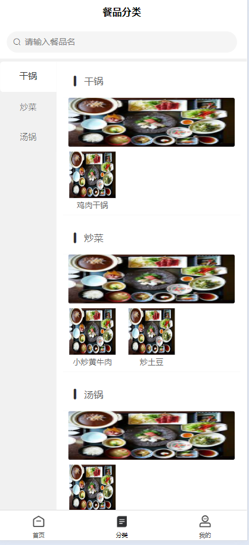

图5.2 餐品分类

餐品查询界面如图5.3所示，在页面加载时，调用 onLoad 方法获取页面参数，并根据参数初始化页面标题和搜索参数。在 onShow 方法中，加载本地存储的搜索历史记录。searchHandle 方法处理搜索操作，根据用户输入的搜索内容或点击的历史记录进行搜索，将搜索记录存储到本地，并跳转到餐品列表页面。learSearchHistory 方法清除所有搜索历史记录，并更新页面展示。goodsPage 方法通过调用全局的 API 接口获取餐品列表数据，并根据当前页面参数动态加载餐品列表。onReachBottom 方法实现上拉加载更多功能，当滚动到页面底部时，自动加载下一页餐品数据。sortHandle 方法处理餐品列表排序操作，根据用户点击的排序类型，更新页面参数并重新加载餐品列表数据。

图5.3 餐品查询界面

#### 登录注册实现

注册界面如图5.4所示，页面包含姓名、手机号码、登录账号、登录密码等输入框，用户填写注册信息。用户可上传头像，点击头像区域可以选择图片上传，并显示已选择的图片列表，支持预览和删除已选择的图片。在页面加载时，通过接收路由传参的方式获取用户信息，若存在用户信息则将信息展示在对应的输入框中，并将用户头像添加到图片列表中。当用户点击确认按钮时，会触发注册操作。如果存在用户信息，则执行更新用户信息操作，否则执行注册操作。在注册操作中，会对用户填写的信息进行合法性校验，如账号和密码长度等，然后调用后端接口进行注册或更新用户信息，并给予相应的提示反馈。注册成功后，跳转到用户中心页面。

图5.4 注册界面

登录界面如图5.5所示，用户输入账号与密码，App调用全局函数api.login进行login接口的HTTP请求，服务端主要代码如下所示：

User user = userMapper.selectOne(new QueryWrapper<User>().eq("number", userName));

if (user == null) {
 throw new ResultException(ResultStatus.ERROR_NUM_PWD);
}
if (this.bCryptPasswordEncoder.matches(password, user.getPassword())) {
 if (user.getType().equals(NOLOGIN)) {
 throw new ResultException(ResultStatus.NOT_PASS_LOGIN);
 }
 List<String> roleList = new ArrayList<>();
 roleList.add("ROLE_USER");
 String token = JwtUtils.generateToken(userName, roleList, false)
 // 认证成功后，设置认证信息到 Spring Security 上下文中
 Authentication authentication = JwtUtils.getAuthentication(token);
 SecurityContextHolder.getContext().setAuthentication(authentication);
 //注入当前用户的基本信息
 UserLocal.setUser(user);
 return new LoginDto(user, SecurityConstants.TOKEN_PREFIX + token);
}

throw new ResultException(ResultStatus.ERROR_NUM_PWD);

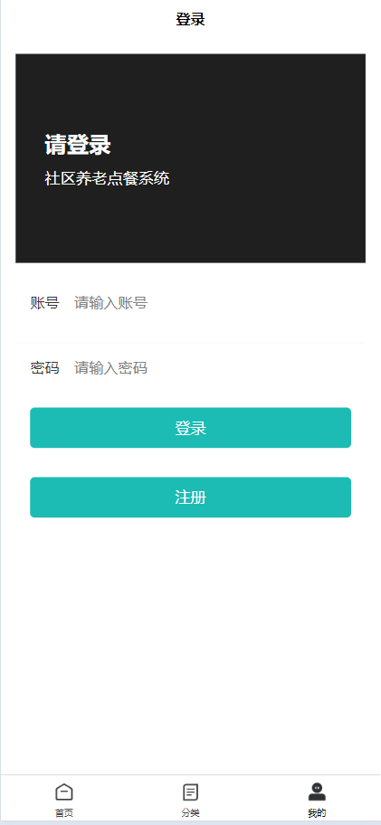

图5.5 登录界面

#### 点餐实现

餐品详情界面如图5.6所示，展示餐品的轮播图、价格、销量、名称、简介等基本信息。支持查看餐品详情信息，包括餐品的详细介绍等。可以根据餐品的状态（上架或下架）显示相应的提示信息。用户可以查看餐品评价，并跳转到评价列表页面。用户点餐按钮，系统跳转订单确定界面。

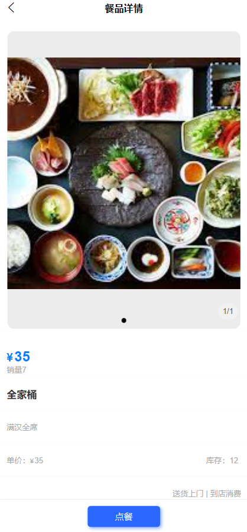

图5.6 餐品详情界面

订单确定界面如图5.7所示，onLoad 函数在页面加载时调用 userAddressPage、userInfoGet 和 orderConfirmDo 方法，分别用于获取用户默认收货地址、商城用户信息和订单确认数据。isDefaultChange 函数用于监听配送方式切换的事件，根据用户选择的配送方式更新 type 的值。orderConfirmDo 函数从本地存储中获取订单确认数据，并计算订单金额和餐品ID，并将结果存储在 orderConfirmData、salesPrice 和 spuIds 中。userAddressPage 函数调用后端接口获取用户默认收货地址，并将结果存储在 userAddress 中。userInfoGet 函数调用后端接口获取商城用户信息，并将结果存储在 userInfo 中。orderSub 函数用于提交订单，首先检查用户是否选择了收货地址，然后构建订单信息并调用后端接口提交订单，最后显示提交成功的提示信息，并跳转到用户中心页面。

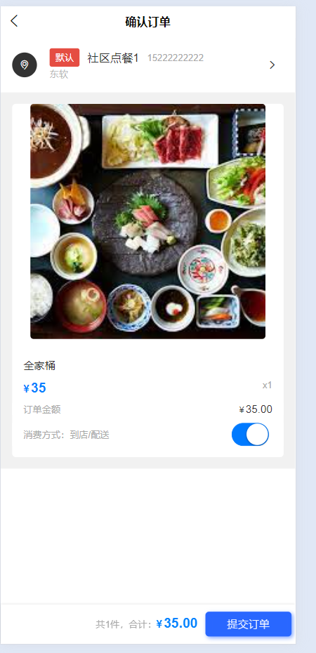

图5.7 点餐界面

#### 个人中心实现

个人中心界面如图5.8所示当 session 不为 null 时，显示个人中心内容，否则显示登录表单。个人中心内容包括用户头像、用户名和修改个人信息按钮，以及订单列表和收货地址等功能入口。如果用户未登录，则显示登录表单，包括账号、密码输入框和登录按钮，以及注册按钮。

我的订单部分展示了用户的订单情况，包括待配送、待完成、待消费、待评价和已完成五个状态，点击可以进入对应状态的订单列表页面。收货地址和我的评价为其他功能入口，点击可以进入对应的页面。退出登录按钮点击后会注销用户登录状态，并返回登录界面。

图5.8 个人中心界面

订单管理界面如图5.9所示，使用了横向滚动的 scroll-view 组件展示订单状态的选项。点击选项可以切换订单状态，对应显示不同状态的订单列表。根据当前选择的订单状态，调用接口获取对应状态的订单数据，并展示在页面中。每个订单项包括订单时间、订单状态、餐品图片、餐品名称、餐品价格等信息。可以点击订单项查看订单详情，并在订单项下方展示了订单操作组件，包括取消订单、确认收货、删除订单和评价订单等操作。

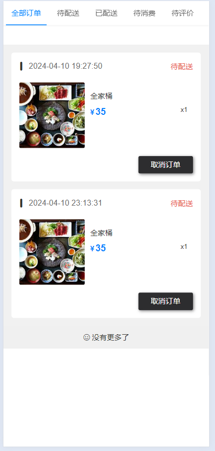

图5.9 订单管理界面

订单详情界面如图5.10所示，订单详情界面采用了与订单管理界面一致的实现方式，通过订单状态来渲染不同的操作按钮。用户可以根据订单状态执行相应的操作，例如确认收货、取消订单、评价订单等。这样的设计使得界面简洁清晰，用户能够方便地了解订单的状态并进行相应的操作。

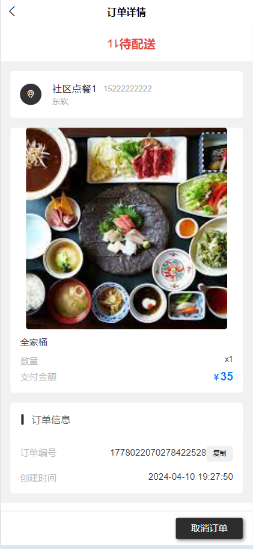

图5.10 订单详情

评价界面如图5.11所示，用户输入完评价信息后，请求服务端接口：/orderCv，服务端修改订单状态为已完成，并向评价表中插入新增的评价数据，代码如下所示，服务端代码使用了声明式事务，保证数据的一致性。

@Transactional(rollbackFor = Exception.class)
@PostMapping("/orderCv")
public void orderCv(@RequestBody Evaluation evaluation) {
 evaluation.setTime(new Date());
 evaluation.setUserId(UserLocal.getUser().getId());
 evaluationService.save(evaluation);
 //修改订单状态
 orderService.updateStatus(evaluation.getOrderId(), 3);
}

图5.11 评价

### 后台实现

#### 用户管理

用户管理界面如图5.12所示，包括了管理员用户和社区点餐用户两个分类。用户可以根据用户姓名和手机号进行搜索，并可以添加管理员用户。界面使用了Element UI的组件，包括了面包屑导航、输入框、按钮、表格、分页等。点击操作按钮可以进行用户的禁止登录、重置密码、允许登录等操作。通过调用接口获取用户列表数据，并根据用户操作更新用户信息。整体实现逻辑清晰，用户操作便捷。

图5.12 用户列表

管理员添加界面如图5.13所示，添加界面整体为Form表单，用户输入完所有信息后，请求接口： /operation，接口根据第四章设计的逻辑，进行操作类型的判断，完成数据的存入，代码如下所示：

public void operationUser(User user, Integer operationType) throws ResultException {
 User dbUser = userMapper.selectById(user.getId());
 int status = 1;
 if (Objects.equals(operationType, USER_NO_LOGIN)) {
 user.setType(NOLOGIN);
 //修改状态
 userMapper.updateById(user);
 } else if (Objects.equals(operationType, USER_LOGIN)) {
 user.setType(CUSTOMER);
 userMapper.updateById(user);
 } else if (Objects.equals(operationType, USER_PASSWORD)) {
 user.setPassword(bCryptPasswordEncoder.encode(getMD5("123456")));
 userMapper.updateById(user);
 } else if (Objects.equals(operationType, USER_UPDATE)) {
 user.setType(dbUser.getType());
 if (!user.getPassword().equals(dbUser.getPassword())) {
 //密码修改
 user.setPassword(bCryptPasswordEncoder.encode(getMD5(user.getPassword())));
 status = 2;
 }
 if (!user.getNumber().equals(dbUser.getNumber())) {
 if (userMapper.selectOne(new QueryWrapper<User>().eq("number", user.getNumber())) != null) {
 throw new ResultException(ResultStatus.NUM);
 }
 }
 //直接修改
 userMapper.updateById(user);
 if (status == 2) {
 //强制退出，重新登录
 SecurityContextHolder.clearContext();
 throw new ResultException(ResultStatus.NO_LOGIN);
 }
 } else {
 //新增走注册接口
 register(user);
 }
}

图5.13 管理员添加

#### 餐品管理

餐品列表界面如图5.14所示，用户可以在界面上进行新增、编辑、删除、上架、下架、查看评价等操作。界面采用了Element UI的组件，包括了面包屑导航、按钮、下拉选择框、输入框、表格、分页等。用户可以通过分类查找和名称模糊查询来筛选餐品列表。点击操作按钮可以对餐品进行相应的操作，如编辑餐品信息、删除餐品、上架或下架餐品，以及查看餐品的评价信息。

图5.14 餐品列表界面

餐品添加界面如图5.15所示，用户可以在此页面对餐品进行新增或编辑操作。界面包括了餐品名称、分类、状态、简介、价格、库存等字段的输入框或选择框，以及轮播图片的上传和预览功能。用户可以通过表单输入或选择相关信息，并上传图片来创建或更新餐品。在编辑状态下，页面会根据传入的餐品信息进行数据回显，方便用户修改。

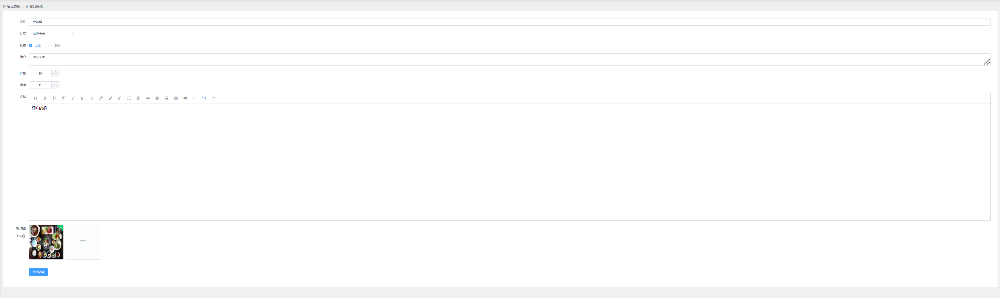

图5.15 餐品添加编辑界面

餐品分类管理界面如图5.16所示，用户可以在此页面对分类进行新增、编辑和删除操作。页面包括分类列表展示、新增分类按钮、分类搜索功能等。用户可以通过表格展示的分类列表进行编辑和删除操作，并且可以根据分类名称进行搜索过滤。对于编辑操作，用户可以修改分类名称和上传分类图片，同时支持图片预览和删除。新增分类功能允许用户选择上级分类并输入分类名称，同样支持上传分类图片。操作完成后，页面会及时更新分类列表数据。

图5.16 餐品分类管理界面

图片上传主要代码如下所示，代码接受一个MultipartFile 类型的文件对象 uploadFile，以及保存文件的路径 filePath 和文件的URL地址 fileUrl。方法的作用是将上传的文件保存到指定的路径，并返回文件的URL地址。

public static Result upload(MultipartFile uploadFile, String filePath, String fileUrl) throws Exception {
 String fileName = uploadFile.getOriginalFilename();
 fileName = new SimpleDateFormat("yyyyMMddHHmmss").format(new Date()) + "_" + fileName;
 //加个时间戳，尽量避免文件名称重复
 String path = filePath + fileName;
 //创建文件路径
 java.io.File dest = new java.io.File(path);
 try {
 //保存文件
 uploadFile.transferTo(dest);
 //构造Url
 return Result.success(fileUrl != null ? fileUrl + fileName : fileName);
 } catch (IOException e) {
 throw new Exception(e.getMessage());
 }
}

#### 订单管理

订单管理界面如图5.17所示，页面布局使用了 Element UI 的面包屑（Breadcrumb）、按钮（Button）、下拉选择框（Select）、输入框（Input）以及表格（Table）等组件进行搭建。通过调用 list、childrenClass 和 exportOrder函数从后端获取订单数据、餐品数据。使用 Element UI 的表格组件（el-table）展示订单信息，包括订单编号、价格、数量、购买时间、收货地址、订单类型、状态等，其中订单状态通过 el-tag 标签展示不同状态。根据订单状态展示不同的操作按钮，例如待配送状态显示配送按钮，待消费状态显示消费按钮，已完成状态显示查看评价按钮等，点击按钮触发相应的操作。点击订单操作中的查看评价按钮可查看订单相关的评论信息，包括评论内容、评论时间、用户姓名等，可以进行回复操作。点击订单操作中的配送按钮可编辑外卖小哥的信息，包括小哥昵称和手机号，保存后生效。

图5.17 订单管理

订单评价如图5.18所示，界面根据评价回复字段，进行回复按钮的控制显示，使用v-if关键字，后台用户可以进行评价回复，可以对评价内容进行分页查询，主要代码如下所示，通过left join 关键字进行评价表与用户表的关联查询，然后通过餐品主键对评价表进行精准查询，获取属于该餐品的评价信息。

select t1.content, t2.name as userName, t1.id, t1.time, t1.reply_content, t1.reply_time, t1.reply_status
from evaluation t1
 left join `user` t2 on t1.user_id = t2.id
where t1.goods_id = #{listVto.goodsId}

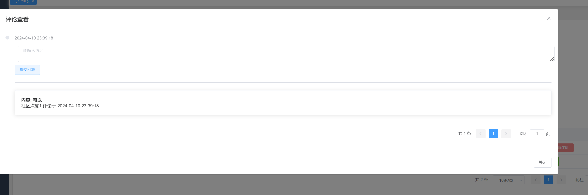

图5.18 评价列表

## 系统测试

### 测试环境与方法

本系统的测试环境为Windows 10操作系统，使用Chrome、Firefox、Edge等主流浏览器进行测试。测试过程中使用的工具包括Postman、IDEAD等。

测试方法采用黑盒测试方法，主要对系统的登录、餐品浏览、点餐、订单管理等模块进行测试。测试人员按照系统设计的流程，测试系统是否能够正常运行、数据是否准确、用户界面是否友好等方面进行测试。

### 测试用例

#### 登录注册

测试App用户是否可以正常进行登录与注册，后台用户登录是否能够查看正确的界面，测试结果如表6.1所示。

表6.1 登录测试表

<table>
<tr><td>用例ID</td><td>输入/动作</td><td>期望结果</td><td>实际情况</td><td>通过/失败</td><td>执行人员</td></tr>
<tr><td>1</td><td>App用户输入账号与密码进行注册账号admin，密码为123456</td><td>注册成功</td><td>注册成功</td><td>通过</td><td>测试人员</td></tr>
<tr><td>2</td><td>App用户输入账号admin，密码123456进行登录</td><td>登录成功</td><td>登录成功</td><td>通过</td><td>测试人员</td></tr>
<tr><td>3</td><td>后台管理员用户登录，输入账号root，密码123456</td><td>登录成功</td><td>登录成功</td><td>通过</td><td>测试人员</td></tr>
<tr><td>4</td><td>后台管理员用户登录，输入账号root2，密码123456</td><td>登录失败</td><td>登录失败</td><td>通过</td><td>测试人员</td></tr>
</table>

#### 餐品浏览

餐品浏览测试主要测试餐品搜索是否正常，列表的分页查询是否正常，分类查询是否正常，用户是否可以正常进行餐品详情查看，是否可以查看该餐品的评价信息，测试结果如表6.2所示。

表6.2 餐品浏览测试表

<table>
<tr><td>用例ID</td><td>输入/动作</td><td>期望结果</td><td>实际情况</td><td>通过/失败</td><td>执行人员</td></tr>
<tr><td>1</td><td>浏览餐品并进行搜索操作，验证搜索功能是否正常</td><td>餐品列表能够根据搜索关键词正确显示相关餐品</td><td>与期望一致</td><td>通过</td><td>测试用户</td></tr>
<tr><td>2</td><td>浏览餐品列表并进行分页查询操作，验证分页功能是否正常</td><td>餐品列表能够按照设定的每页显示数量正确分页显示</td><td>与期望一致</td><td>通过</td><td>测试用户</td></tr>
<tr><td>3</td><td>浏览餐品列表并进行分类查询操作，验证分类查询功能是否正常</td><td>餐品列表能够根据选择的分类正确显示相应餐品</td><td>与期望一致</td><td>通过</td><td>测试用户</td></tr>
<tr><td>4</td><td>用户点击餐品详情查看按钮，验证是否能正常查看餐品详情</td><td>能够正常查看该餐品的详细信息，包括名称、价格、图片等</td><td>与期望一致</td><td>通过</td><td>测试用户</td></tr>
<tr><td>5</td><td>用户查看餐品详情页面下的评价信息，验证评价信息是否正常显示</td><td>能够正常显示该餐品的评价信息，包括评价内容、评价人、评价时间等</td><td>与期望一致</td><td>通过</td><td>测试用户</td></tr>
</table>

#### 点餐测试

点餐测试用例中，主要测试未登录用户是否可以进行点餐，登录后的用户进行点餐，送货类型不同（到店与配送）界面是否会展示收货地址选择（配送展示），用户点击下单后，系统界面是否会跳转到个人中心。

表6.3 点餐测试

<table>
<tr><td>用例ID</td><td>输入/动作</td><td>期望结果</td><td>实际情况</td><td>通过/失败</td><td>执行人员</td></tr>
<tr><td>1</td><td>未登录用户尝试进行点餐操作</td><td>系统提示需要登录才能进行点餐操作</td><td>与期望一致</td><td>通过</td><td>测试用户</td></tr>
<tr><td>2</td><td>登录用户进行点餐操作</td><td>用户能够正常浏览菜单并选择餐品进行点餐</td><td>与期望一致</td><td>通过</td><td>测试用户</td></tr>
<tr><td>3</td><td>用户选择送货类型为到店取餐</td><td>系统界面不展示收货地址选择，只显示到店取餐的相关信息</td><td>与期望一致</td><td>通过</td><td>测试用户</td></tr>
<tr><td>4</td><td>用户选择送货类型为配送</td><td>系统界面展示收货地址选择，用户可以选择收货地址</td><td>与期望一致</td><td>通过</td><td>测试用户</td></tr>
<tr><td>5</td><td>用户点击下单后系统跳转到个人中心页面</td><td>下单成功后系统能够自动跳转到用户个人中心页面</td><td>与期望一致</td><td>通过</td><td>测试用户</td></tr>
</table>

#### 订单管理测试

订单管理测试主要测试后台用户对订单状态进行修改，待配送修改为已配送，App用户是否可以进行完成，App用户完成订单后，是否可以进行评价，评价完成后，订单状态是否修改为已完成，且是否有评价记录，后台针对已完成的订单是否可以进行评价查看与回复，测试结果如表6.4所示。

表6.4 订单管理

<table>
<tr><td>用例ID</td><td>输入/动作</td><td>期望结果</td><td>实际情况</td><td>通过/失败</td><td>执行人员</td></tr>
<tr><td>1</td><td>后台用户将待配送订单修改为已配送状态</td><td>订单状态成功从待配送变更为已配送</td><td>与期望一致</td><td>通过</td><td>测试用户</td></tr>
<tr><td>2</td><td>App用户完成已配送订单</td><td>用户可以成功完成已配送的订单</td><td>与期望一致</td><td>通过</td><td>测试用户</td></tr>
<tr><td>3</td><td>App用户完成订单后进行评价</td><td>用户成功对订单进行评价</td><td>与期望一致</td><td>通过</td><td>测试用户</td></tr>
<tr><td>4</td><td>订单状态是否修改为已完成</td><td>订单状态正确修改为已完成</td><td>与期望一致</td><td>通过</td><td>测试用户</td></tr>
<tr><td>5</td><td>订单完成后是否有评价记录</td><td>订单成功完成后有对应的评价记录</td><td>与期望一致</td><td>通过</td><td>测试用户</td></tr>
<tr><td>6</td><td>后台可以查看已完成订单的评价记录</td><td>后台用户可以查看已完成订单的评价记录</td><td>与期望一致</td><td>通过</td><td>测试用户</td></tr>
<tr><td>7</td><td>后台用户可以对已完成订单的评价进行回复</td><td>后台用户可以对已完成订单的评价进行回复</td><td>与期望一致</td><td>通过</td><td>测试用户</td></tr>
</table>

## 结论

社区养老服务点餐系统是一款为社区养老服务提供支持的重要工具，通过该系统，可以有效地管理社区内老人的饮食需求，提高服务效率，增强社区养老服务的质量和便利性。在本文中，我们对社区养老服务点餐系统进行了设计和实现，并进行了功能介绍和分析。

首先，我们设计了系统的整体架构和功能模块。系统主要包括用户管理、餐品管理、订单管理、评价管理等核心模块，通过这些模块，可以实现老人用户的注册、登录、点餐、评价等功能。同时，系统还包括了管理员后台管理模块，用于对用户、餐品、订单等信息进行管理和监控。

其次，我们详细介绍了系统的各项功能特点和实现方法。在用户管理模块中，通过对老人用户信息的管理，实现了老人用户的注册、登录和个人信息修改功能，保障了用户信息的安全性和准确性。在餐品管理模块中，我们通过对餐品信息的管理，实现了餐品的分类、浏览和搜索功能，使老人用户可以方便地浏览和选择自己喜欢的餐品。在订单管理模块中，我们实现了老人用户的点餐、订单查看和订单取消等功能，保证了老人用户的点餐便捷和订单信息的准确性。在评价管理模块中，我们实现了老人用户对餐品的评价和管理员对评价信息的管理，促进了餐品质量的提升和服务的改进。

最后，我们对系统的优势和未来发展方向进行了展望。社区养老服务点餐系统通过提供便捷的点餐服务，有效地满足了老人用户的饮食需求，提高了社区养老服务的服务质量和用户满意度。未来，我们可以进一步完善系统的功能，引入智能推荐算法，根据老人用户的口味偏好和营养需求，推荐适合的餐品；同时，可以加强与社区医疗服务的对接，实现老人用户的健康管理和医疗服务的整合，为老人用户提供更加全面的养老服务。同时，我们还可以结合物联网技术，实现对老人用户饮食习惯和健康状况的实时监测，为老人用户提供更加个性化和精准的养老服务。

综上所述，社区养老服务点餐系统是一款具有重要意义的养老服务工具，通过提供便捷的点餐服务，有效地满足了老人用户的饮食需求，为社区养老服务的提升和发展做出了积极的贡献。在未来的发展中，我们将进一步完善系统功能，提升服务质量，为老人用户提供更加优质的养老服务。
